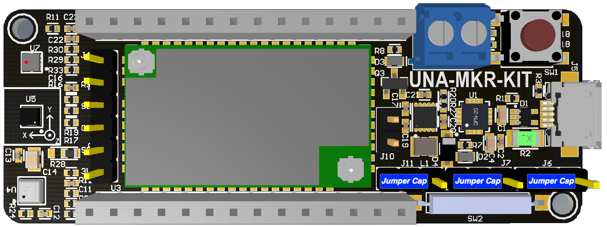

# UnaMKR Arduino Tutorial

This tutorial will guide you through getting your UnaMKR up and running in a minimum of time!

# Prerequisites

* Data-enabled MicroUSB cable
* Computer with at least 1 available USB port
* Arduino Board [MKRZero](https://store.arduino.cc/usa/arduino-mkrzero)
* And … UnaMKR :-)

# Setup UnaMKR board

## Arduino mode

UnaMKR comes out-of-the-box in [Arduino mode](20-Modes).

* Make sure the Jumpers on UnaMKR are setup as below. If not, please adjust them accordingly.

## Install Sigfox Antenna

* Get the IPEX-to-SMA cable and the SMA Antenna
* Screw them together (no tools are required)
* Attach the IPEX side to UnaMKR IPEX Sigfox Antenna connector

## Attach the boards

* Attach UnaMKR on top of the Arduino board matching all the Pins
* Result should look like the following picture

## Test the setup

* Use the Micro USB cable to attach the Arduino USB Port to your computer USB
* The UnaMKR LED should light up steady GREEN. If not, please verify all previous steps were done properly.

# Setup Arduino environment

It's now time to get your computer ready to access Sigfox 0G network!

## Arduino IDE

* Download and install the latest [Arduino IDE](https://www.arduino.cc/en/Main/Software)

## MKRZero board support

* Open Arduino IDE
* Click on menu `Tools` → `Board:...` → `Boards Manager...`
* Search "MKRZero"
* Install the "Arduino SAMD Boards"

## Sensors support

Some sensors on UnaMKR require some additional libraries to work properly.

Let's install them now.

* Open Arduino IDE
* Click on menu `Sketch` → `Include Library` → `Manage Libraries...`
* Search and install all the following libraries
  * [Adafruit_Sensor](https://github.com/adafruit/Adafruit_Sensor)
  * [Adafruit_BME680](https://github.com/adafruit/Adafruit_BME680)
  * [Adafruit_ZeroTimer](https://github.com/adafruit/Adafruit_ZeroTimer)
  * [STM32duino_LSM303AGR](https://github.com/stm32duino/LSM303AGR)

## UnaMKR support

Almost there, finally let's add the UnaMKR Arduino Library.

* Browse to [https://github.com/UnaBiz/unamkr/](https://github.com/UnaBiz/unamkr)
  * Click on `Clone or download` > `Download ZIP`
  * This will download the UnaMKR library to your typical Downloads folder
* Open Arduino IDE
* Click on menu `Sketch` → `Include Library` → `Add .ZIP Library...`
* Select the downloaded zip file

* Click on menu `File` > `Examples`. You should see `UnaMKR`

# Setup data visualization

!> TODO: Add UnaConnect / UnaMe integration

<!--  -->
# Run Example code

Now that everything is setup, it's now time to send UnaMKR sensor data via Sigfox 0G network.

* Open Arduino IDE
* Click on menu "Tools"
* Make sure the proper Board is selected "Arduino MKRZERO"
* Make sure the proper Port is selected
  * On Windows: should look like `COMxx`
  * On Mac OS: should look like `/dev/cu.SLAB_USBtoUART`
  * On Linux: should look like `/dev/ttyACM0` or `/dev/ttyUSB0`

* Click on menu `File` → `Examples` → `UnaMKR` → `Demo_Sigfox-AllSensors`
* Click on menu `Sketch` → `Upload`
* Wait a few seconds, the message `Done uploading` will appear in the status bar.

?> This example code is sending all UnaMKR sensors value every 10 minutes.

The process can be manually triggered by doing one of the following action:
* Press the button on the UmaMKR
* Putting a magnet up to the reed switch

?> The code stays in your Arduino MKRZERO memory and will restart everytime the MKRZERO is powered up until you upload another code into the MKRZERO.

* You can see raw data using Sigfox backend.
