# UnaMKR Hardware

This document contains information about UnaMKR hardware.

## Schematic

This part of the documentation is a representation of the UnaMKR onboard components.

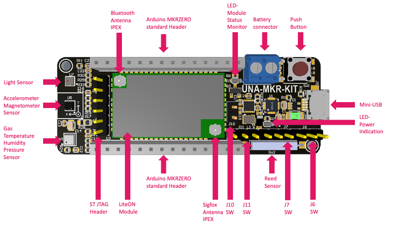

## Antenna Connectors

This is how to connect antennas to UnaMKR.

## Sigfox Antenna

* Firstly connect the IPEX to SMA cable to the UnaMKR
* Then screw on the antenna to the SMA connector

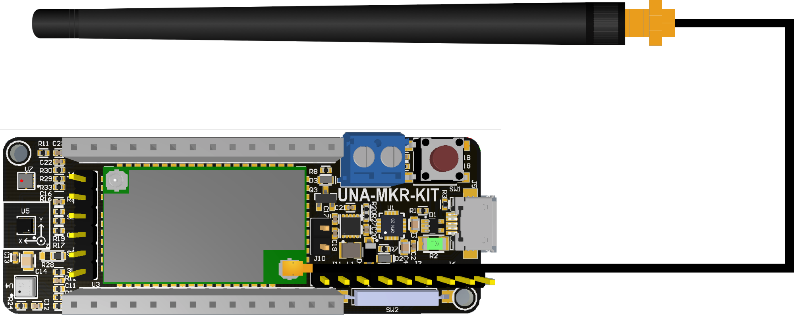

## Bluetooth Antenna

* Connect the IPEX of the bluetooth antenna to the UnaMKR

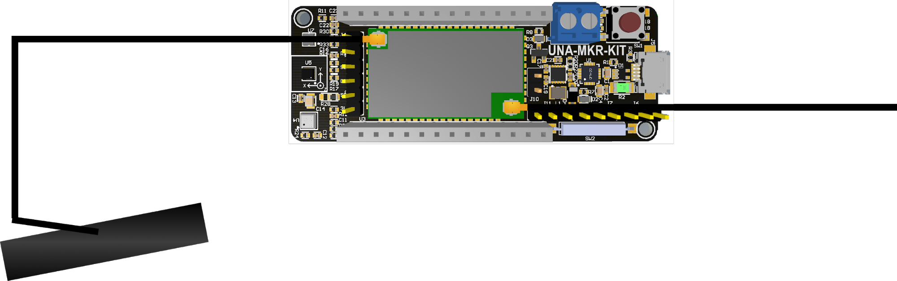

## Jumpers Definition

| Jumper J11 | Select Power Source |
:---:|:---:
| From Arduino | From USB |
| 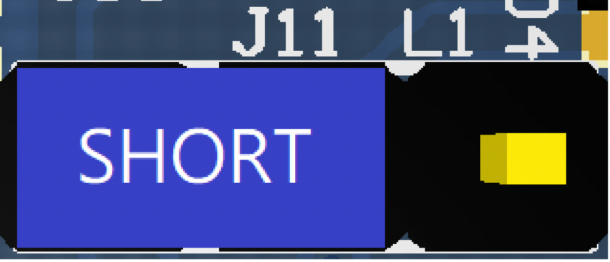 | 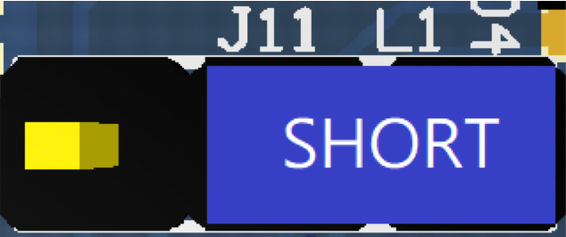

| Jumper J7 | Select UART RX Line |
:---:|:---:
| From Arduino | From USB |
| 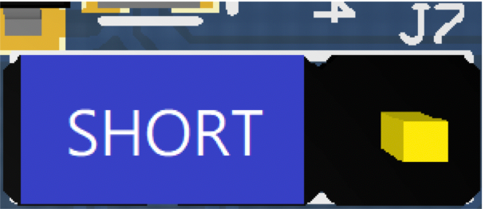 | 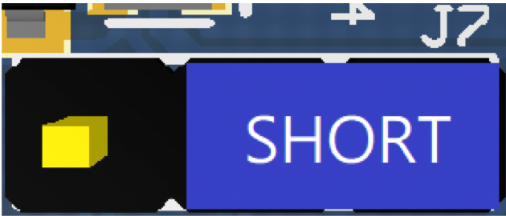

| Jumper J6 | Select UART TX Line |
:---:|:---:
| From Arduino | From USB |
| 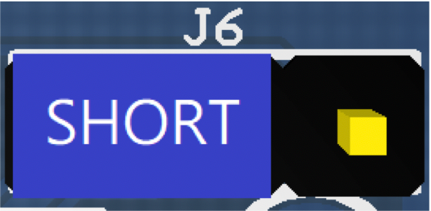 | 

| Jumper J10 | Flash mode |
:---:|:---:
| Enable | Disable |
| 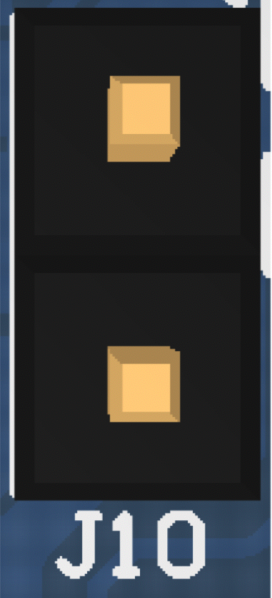 | 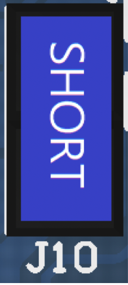

| Jumper J14 | ST JTAG |
:---:|:---:
| Pin 1 | 3V3 |
| Pin 2 | SWCLK |
| Pin 3 | GND |
| Pin 4 | SWDIO |
| Pin 5 | NRST |
| Pin 6 | NC |

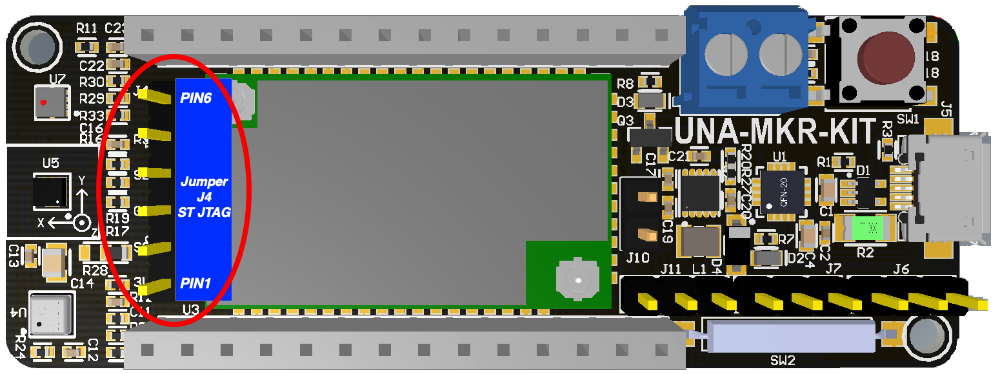

## Sensors I2C Addresses

| Sensor | I2C Address |
---|---:
| Accelerometer Sensor(LSM303AGR)| 0x19
| Magnetometer Sensor(LSM303AGR)| 0x1E
| Gas Sensor(BME280) |0x77
| Temperature Sensor(BME280) |0x77
| Humidity Sensor(BME280) |0x77
| Pressure Sensor(BME280) |0x77
| Light Sensor(TSL2540)| 0x39

## Pin Assignment

| Arduino Pins | UnaMKR V1.2                    | Description                                                 |
|--------------|--------------------------------|-------------------------------------------------------------|
| AREF         | NC                             | Voltage Reference System                                    |
| A0           | NC                             | Analog Pin-0                                                |
| A1           | NC                             | Analog Pin-1                                                |
| A2           | NC                             | Analog Pin-2                                                |
| A3           | NC                             | Analog Pin-3                                                |
| A4           | NC                             | Analog Pin-4                                                |
| A5           | NC                             | Analog Pin-5                                                |
| A6           | NC                             | Analog Pin-6                                                |
| 0            | SDN                            | S2LP SDN                                                    |
| 1            | Push Button                    | Push button；Push to low signal level                       |
| ~2           | Light Sensor Interrupt         | Light Sensor Interrupt                                      |
| ~3           | Magnetometer Sensor Interrupt  | Magnetometer Sensor Interrupt                               |
| ~4           | Accelerometer Sensor Interrupt | Accelerometer Sensor Interrupt                              |
| ~5           | NC                             | Digital Pin-5                                               |
| 6            | Reed Sensor                    | Reed Sensor                                                 |
| 7            | NC                             | Digital Pin-7                                               |
| 8 MOSI       | NC                             | Digital Pin-8                                               |
| 9 SCK        | NC                             | Digital Pin-9                                               |
| 10 MISO      | NC                             | Digital Pin-10                                              |
| 11 SDA       | SDA                            | I2C-SDA                                                     |
| 12 SCL       | SCL                            | I2C-SCL                                                     |
| 13 RX        | RX                             | Arduino MKRZERO UART receiving pin; UnaMKR transmitting pin |
| 14 TX        | TX                             | Arduino MKRZERO UART transmitting pin; UnaMKR receiving pin |
| RESET        | RESET                          | Reset Arduino MCU & Sigfox Module；Low active               |
| GND          | GND                            | Grounding & power/signal reference level                    |
| VCC          | NC                             | 3V3 Power Source from Arduino platform                      |
| VIN          | NC                             | Extra power source input of Arduino platform                |
| 5V           | 5V                             | 5V Power Source from Arduino platform
