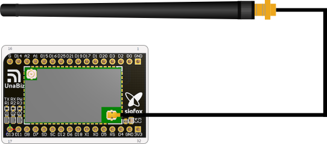
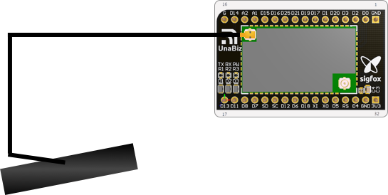

# UnaMKR Mini Hardware

This document contains information about UnaMKR mini hardware.

## Schematic

This part of the documentation is a representation of the UnaMKR onboard components.

## Pin Assignment

| UnaMKR mini Pin Number | UnaMKR mini Pin Name | LiteOn Module Pin Name  | Description |
| --- | --- | --- | --- |
| 1 | GND |   | GND |
| 2 | D0 | S2-LP SCLK | Connect to BlueNRG-2\_DIO0 |
| 3 | D2 | S2-LP SDI | Connect to BlueNRG-2\_DIO2 |
| 4 | D3 | S2-LP SDO | Connect to BlueNRG-2\_DIO3 |
| 5 | D20 | S2-LP CSN | Connect to BlueNRG-2\_DIO20 |
| 6 | D1 | DIO1 | BlueNRG-2\_DIO1 |
| 7 | D17 | DIO17 | BlueNRG-2 DIO17 |
| 8 | D19 | S2-LP GPIO2 | Connect to BlueNRG-2\_DIO19 |
| 9 | D21 | S2-LP GPIO3 | Connect to BlueNRG-2\_DIO21 |
| 10 | D25 | S2-LP SDN | Connect to BlueNRG-2\_DIO25 |
| 11 | D16 | DIO16 | BlueNRG-2 DIO16 |
| 12 | D15 | DIO15 | BlueNRG-2 DIO15 |
| 13 | A1 | ADC1 | BlueNRG-2 ADC1 |
| 14 | A2 | ADC2 | BlueNRG-2 ADC2 |
| 15 | D14 | DIO14 | BlueNRG-2 DIO14 |
| 16 | GND |   | GND |
| 17 | D13 | DIO13 | BlueNRG-2 DIO13 |
| 18 | D11 | UART\_RX | BlueNRG-2 DIO11 |
| 19 | D8 | UART\_TX | BlueNRG-2 DIO8 |
| 20 | D7 | DIO7 | BlueNRG-2 DIO7 |
| 21 | SD | JTMS-SWTDIO | SW DIO (BlueNRG-2 DIO10) SWD data signal |
| 22 | SC | JTMS-SWTCK | SW CLK (BlueNRG-2 DIO9) SWD clock signal |
| 23 | D12 | DIO12 | BlueNRG-2 DIO12 |
| 24 | D6 | DIO6 | BlueNRG-2 DIO6 |
| 25 | D18 | DIO18 | BlueNRG-2 DIO18 |
| 26 | XI | XI | Reserve for external RTC 32.768k |
| 27 | XO | XO | Reserve for external RTC 32.768k |
| 28 | D5 | I2C2\_DAT | BlueNRG-2 DIO5 (module internal PU 10k) |
| 29 | RS | RESETN | BlueNRG-2 RESETN (module internal PU 100k) Low Active |
| 30 | D4 | I2C2\_CLK | BlueNRG-2 DIO4 (module internal PU 10k) |
| 31 | GND |   | GND |
| 32 | 3V3 |   | 3V3 |

## Electrical characteristics
- Power Supply: From 2.1V to 3.6V
- Power Consumption:
	- 121mA Tx at 22dBm (peak current with Sigfox packet transmission) 
	- 33mA Tx at 14dBm (peak current with Sigfox packet transmission) 
	- 31mA Tx at 13dBm (peak current with Sigfox packet transmission) 
	- 22mA Tx at 4dBm with BT packet transmission 
	- 6.17uA at sleep mode

## Antenna Connectors

This is how to connect antennas to UnaMKR mini.

## Sigfox Antenna

* Firstly connect the IPEX to SMA cable to the UnaMKR mini
* Then screw on the antenna to the SMA connector

## Bluetooth Antenna

* Connect the IPEX of the bluetooth antenna to the UnaMKR mini

