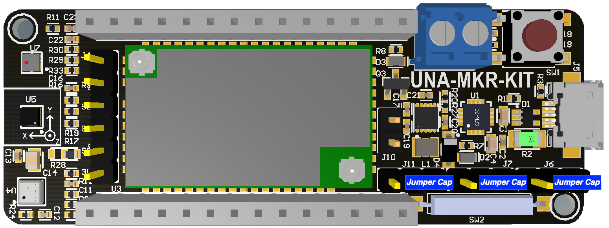

# UnaMKR Operating Modes

UnaMKR has been designed to run in different operating modes to fit different needs.

There are 3 modes available:

*   "Modem": USB Sigfox Modem
*   "Arduino": Standard Arduino MKR shield
*   "Embed": Standalone ultra low power IoT device, powered by ST BlueNRG-2 SoC

# Comparing the modes

| Criteria | Arduino | Modem | Embed
---|:---:|:---:|:---:
| Audience | Maker | Integrator | Firmware Experts
| Power Consumption | + | - | --
| Power Source | Arduino Pins | Micro USB / DC | Micro USB / DC
| Available Sensors | All | None | All

# Prerequisites

*   Data-enabled MicroUSB cable
*   Computer with at least 1 available USB port
*   Computer with Windows (only supported Operating System by ST tools)
*   Total of 4 Jumpers
*   And … UnaMKR :-)

# Switching mode

Following table indicates the actions to take depending on the current and target modes:

| Current Mode | Target Mode | Flash firmware | Position Jumpers | Go to |
:---:|:---:|:---:|:---:|:---:
| Arduino | Embed | Yes | Yes | [Flash Firmware](20-Modes?id=programming-proper-firmware)
| Modem | Embed | Yes | No | [Flash Firmware](20-Modes?id=programming-proper-firmware)
| Embed | Arduino | Yes | Yes | [Flash Firmware](20-Modes?id=programming-proper-firmware)
| Embed | Modem | Yes | No | [Flash Firmware](20-Modes?id=programming-proper-firmware)
| Arduino | Modem | No | Yes | [Position Jumpers](20-Modes?id=positioning-jumpers)
| Modem | Arduino | No | Yes | [Position Jumpers](20-Modes?id=positioning-jumpers)

## Programming proper firmware

!> CAUTION  \
Please do not interrupt/disconnect device when FLASH programming.

1. Power off UnaMKR (remove all USB or Power cables)
2. Make sure UnaMKR isn't attached to any Arduino board
3. Connect Jumpers
  * J10 ON
  * J11 RIGHT
  * J7 RIGHT
  * J6 RIGHT
4. Make sure you have installed the [relevant driver](https://www.silabs.com/products/development-tools/software/usb-to-uart-bridge-vcp-drivers)
5. Connect UnaMKR to your computer using a MicroUSB cable

6. Copy your firmware binary file to folder ‘Firmware’ and replace old binary file with the same file name.
7. Select \*.BAT that you would like to burn. In BAT script, the binary data is specific. If you would like to modify script, please notice that the data name and path of binary file is correct.
8. Execute burnFw.bat. The tool is going to upload firmware to UnaMKR via UART COM port automatically. Please wait until procedure completed (should)
9. Done!

!> Unconnect Jumper J10 to exit Flash mode

## Positioning Jumpers

*   Arduino Mode (Factory Default)
    *   J11 LEFT
    *   J7 LEFT
    *   J6 LEFT

*   Modem and Embed Modes
    *   J11 RIGHT
    *   J7 RIGHT
    *   J6 RIGHT

?> Note: Check [hardware documentation](10-Hardware) for more details.

## Cleaning up

* Power recycle UnaMKR
