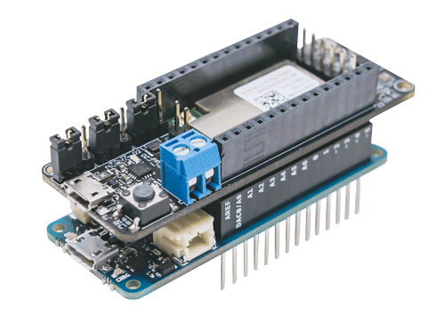
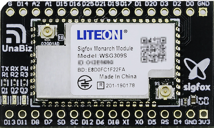

# About UnaMKR

> Your access to the 0G World

UnaMKR is a versatile low-power development kit for Sigfox and Bluetooth.

UnaMKR was designed by [UnaBiz](https://www.unabiz.com).

## Versions

|Version   | Description                                                  |
|:--------:|--------------------------------------------------------------|
| V0-alpha | Released in Oct 2018 @ Sigfox Connect Berlin.                |
| V1       | Released in Jun 2019. General Availability in Aug 2019.      |

## Features

* Versatile Sigfox Development Kit (Arduino, Modem and Embed)
* World 0G Network Ready ([Sigfox Monarch](https://build.sigfox.com/monarch), RC1-6)
* Compatible with Arduino MKRZero
* Quick integration with dedicated Arduino Libraries
* Hybrid Short range (BLE) and Long range (Sigfox)
* Ultra-Low Power mode
* BLE Beacon and Scanner
* Embedding industrial-grade sensors
* Simple data integration via UnaConnect

## Specifications

| Feature               | Description |
|-----------------------|---------|
| Sigfox                | Monarch |
| [Sigfox Radio Configurations](https://build.sigfox.com/sigfox-radio-configurations-rc) | RC1, RC2, RC3, RC4, RC5, RC6 |
| Bluetooth             | 5.0 |
| Antenna connectors    | IPEX SMA |
| Onboard sensors       | Accelerometer  Magnetometer Gas/VOC Temperature Humidity Air Pressure Light Reed Switch Push Button |
| Arduino Compatibility | MKRZero |

## Tutorials and References

Several documents are available to have a better understanding of UnaMKR capabilities.

* For absolute beginners, go check our tutorial series
* [UnaMKR Modem Tutorial](01-Tutorial-Modem "UnaMKR Modem Tutorial")
* [UnaMKR Arduino Tutorial](02-Tutorial-Arduino "UnaMKR Arduino Tutorial")
* [UnaMKR Hardware](10-Hardware "UnaMKR Hardware")
* [UnaMKR Operating Modes](20-Modes "UnaMKR Operating Modes")
* [UnaMKR Arduino mode Reference](30-Arduino "UnaMKR Arduino mode Reference")
* [UnaMKR Modem mode Reference](39-Modem "UnaMKR Modem mode Reference")

Additional documents are soon to be released:

* UnaMKR Embed mode
* UnaMKR Integration with UnaConnect + UnaMe

# About UnaMKR Mini

The UnaMKR mini is the new family of UnaMKR, it is a low cost breakout board form factor that enables the rapid development and deployment to start with your IoT projects.

UnaMKR mini was designed by [UnaBiz](https://www.unabiz.com).

## Versions

|Version   | Description                                                  |
|:--------:|--------------------------------------------------------------|
| V1       | Released in Nov 2019. General Availability in Nov 2019.      |

## Features

* World 0G Network Ready ([Sigfox Monarch](https://build.sigfox.com/monarch), RC1-6)
* Hybrid Short range (BLE) and Long range (Sigfox)
* Ultra-Low Power mode
* BLE Beacon and Scanner

## Specifications

| Feature               | Description |
|-----------------------|---------|
| Sigfox                | Monarch |
| [Sigfox Radio Configurations](https://build.sigfox.com/sigfox-radio-configurations-rc) | RC1, RC2, RC3, RC4, RC5, RC6 |
| Antenna connectors    | IPEX |

## Tutorials and References

Several documents are available to have a better understanding of UnaMKR mini capabilities.

For absolute beginners, go check our tutorial series:

* [UnaMKR Mini Tutorial](01.1-Tutorial-Modem.md "UnaMKR Mini Tutorial")
* [UnaMKR Mini Hardware](10.1-Hardware.md "UnaMKR Mini Hardware")
* [UnaMKR Mini AT commnand Reference](39.1-Modem.md "UnaMKR Mini Modem mode Reference")

# Getting UnaMKR and UnaMKR Mini

UnaMKR and UnamKR mini are available for order through one of the following contacts/distributors.

| Country   | Contact |
|:---------:|---------|
| Singapore | Ms. Ashikin Anuar Pre Sales [ashikin.anuar AT unabiz.com](mailto:ashikin.anuar@unabiz.com) |
| Taiwan    | Mr. Carter Ho Sales Director [carter.ho AT unabiz.com](mailto:carter.ho@unabiz.com) |

?> If your country isn't listed above or have a specific enquiry, please contact [us](https://www.unabiz.com/contact).

# Frequently Asked Questions

> UnaMKR vs UnaShield, which one is right for me?

UnaMKR and UnaShield have been designed for different purposes.

UnaMKR is great for:

* Traveling around the world in countries with different Sigfox Radio Configurations
* BLE beacon and scanner
* Running Ultra-low power consumption (below 10mA)
* Having most common environmental sensors all-in-1 board

UnaShield is great for:

* Single Sigfox Radio Configuration projects
* Using Grove sensors
* Using simple onboard sensors (Temperature, Humidity, Air Pressure, Accelerometer, Magnetometer, Push Button)

If you ask us, we love both :)

> Is UnaShield deprecated?

Of course, not!

UnaShield remains available (and is still great!).
